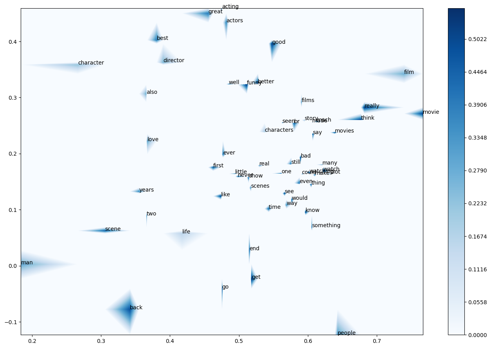

# Contour Plots and Word Embedding Visualisation in Python
Python code for **Contour Plots and Word Embedding Visualisation in Python**, *Towards Data Science (Medium)*, 2022-11-15.
Article is [here.](https://towardsdatascience.com/contour-plots-and-word-embedding-visualisation-in-python-9dd2dacff6ac?sk=035d72e010f96883c591c09e5cbb3d16). Data are here: [here](https://towardsdatascience.com/contour-plots-and-word-embedding-visualisation-in-python-9dd2dacff6ac?sk=035d72e010f96883c591c09e5cbb3d16)

 

  

